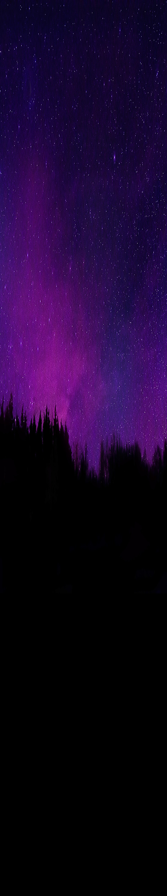

<h1>Memoria del proyecto fin de evaluación de Lenguajes de Marcas - 1º DAW</h1>
<h2>The 100 - A tribute site</h2>
<h2>Indice</h2>
<ul>
  <li><a href="#introduccion">Introducción</a></li>
  <li><a href="#motivacion">Motivación</a></li>
  <li><a href="#estructura">Estructura</a></li>
  <li><a href="#estilo">Estilo</a></li>
  <li><a href="#snippets">Snippets</a></li>
</ul>

<h2 id="introduccion">Introducción</h2>

Trabajo realizado por: Rafael Maldonado triana

Proyecto de web "from scratch" de 1ª evaluación de Lenguajes de Marcas

Diciembre de 2023 

Licencia CC-BY

<h2 id="motivacion">Motivación</h2>

He esogido hacer el trabajo sobre esta serie debido a que fue una serie que vi con la edad que tenían los protagonistas y me mostraba como podían ser muchas cosas , además me aportó muchos valores. 

<h2 id="estructura">Estructura</h2>

La web está dividida en varias secciones:

<ul>
  <li>Hero Section</li>  
  <li>Introducction</li>
  <li>Resume</li>
  <li>Serie Division</li>
  <li>Seasons</li>
  <li>Main Characters</li>
  <li>Footer</li>
</ul>

<h3>Hero Section</h3>

He utilizado una imagen de fondo tomada de google imágenes que se adapta fácilmente a diferentes dispositivos.... 

<h3>Introducción</h3>

He dispuesto en un grid de 2 columnas en el que a la inquierda quedaría un poco de la explicación de la serie y a la derecha una foto sobre la serie

<h3>Footer</h3>

El footer contiene las diferentes redes sociales disponibles , además de los créditos, también contiene un apartado para volvel a la zona de la página que quieras 

<h2 id="estilo">Estilo de la página</h2>
<h3>Tipografías</h3>

Las tipografías usadas pertenecen a una página de internet llamada "fontawesome , y he escogido algunas q creía que quedarían bien

<h3>Imágenes</h3>

Las imágenes , la mayoría proceden de google imágenes , aunque otras muchas , perteneces a pinterest.

<h3>Videos</h3>

Todos los videos han sido sacado de youtube

...................
<h2 id="snippets">Code snippets</h2>

He utilizado los siguientes:

<ul>
  <li>Barra de navegación: tomada de w3Schools "How to" "https://www.w3schools.com/howto/howto_js_responsive_navbar_dropdown.asp"   </li>
  <li>Accordion: tomada de w3school  https://www.w3schools.com/howto/howto_js_accordion.asp</li>
  <li>carrousel : tomada las ideas entre w3school y algún tutorual de youtube : https://www.youtube.com/shorts/3KFCjEGbjQY </li>
  <li>El efecto de las imagenes de los characters fue con ayuda de youtube : https://www.youtube.com/shorts/D1p2Sl6lxX4 </li>
</ul>